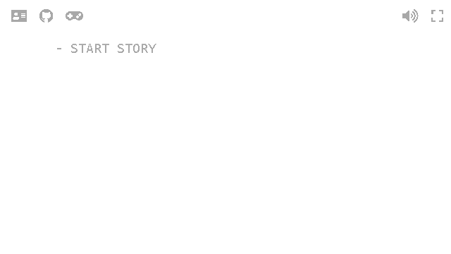

# while(unsolved)
This story is a noir style text-based adventure game where you the player have to solve the crime you are accused of, but of course did not do.

The project was made for the 2018 [Game Maker's Toolkit Jam](https://itch.io/jam/gmtk-2018) and [inkJam](https://itch.io/jam/inkjam). Which both were held during the first weekend of September. It is made for the browser and is made possible using Inkjs.

Believe it or not the idea started out as a Metroidvania... As a one man development team I had some limitations so the first element to go was any artwork, then the twist: no backtracking. So how do you solve for this in a genre full of backtracking, well the day loops instead. As you continue to play you learn more about the world and perhaps in the end you have puzzled enough together to solve the mystery completely. In other words I might have re-invented the wheel here.

I am incredibly happy with the system I managed to botch together in such a short period of time. However in the end my largest problem turned out to be the time I had left to write the story and fill in all the details, add a few read haring's here and there, as well as expand the world further.

All in all I just fell in love with the idea of a noir flick being narrated using the most obliviously robotic voice.

## Browser compatibility
The project has been tested and developed with Chrome version 68 (64-bit for Windows) in mind. However other modern and up-to-date browser should yield similar results, although optional features might not work.

## Play
Visit [whileunsolved.rondekker.nl](https://whileunsolved.rondekker.nl) to play through the story.

## Source
Visit [the GitHub repository](https://github.com/redkenrok/gj-whileunsolved) to see the source code.